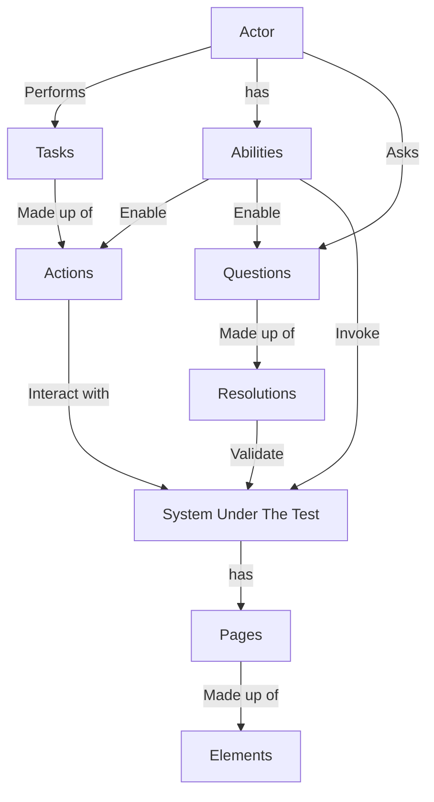

# Screenplay Pattern Description

The screenplay pattern has 5 key elements.

* Actor
* Task
* Actions
* Questions
* Abilities

## Screenplay Flowchart Diagram



## Actor

* An actor represents a user of the system.
* A user interacting with the system is called an "Actor." Actors are the central part of the Screenplay pattern.

## Abilities

* Abilities enable actors to initiate interactions.
* The actors have one or more "Abilities," such as the ability to browse the web or to query a web service.

## Tasks

* These are high-level business interactions that an actor can perform.
* The actors can also perform "Tasks," such as adding an item or removing items.

## Actions

* The smallest unit of work in the Screenplay Pattern. They represent a single interaction with the system.
* To interact with the application, such as entering values into the fields or clicking on buttons, the actors need to
  interact with the applications; these interactions are "Actions."

## Questions

* Questions are used to gather information about the state of the system.
* Actors ask "Questions" about the state of the system, e.g., reading the value of a field on the screen or querying a
  web service, this is the way to test using the Screenplay
  pattern.

## How to Implement the Screenplay Pattern step by step?

### Page Objects (UI)

Create PageObject in a refactored and effective manner

### Tasks

Create Tasks for the above created PageObjects

### Questions

Create a Question to fetch the data

### Tests

Create a test

## Code Example

```python


# Key element: Actor
class Actor:
    def __init__(self, name):
        self.name = name
        self.abilities = {}

    def ability(self, name, func):
        self.abilities[name] = func

    def execute(self):
        for task in self.tasks:
            task()

    # Key element: Ability
    @ability("Login")
    def login(self):
        # Action: Go to the login page.
        self.page.goto("https://example.com/login")

        # Action: Fill in the username field.
        self.page.fill("#username", "john.doe")

        # Action: Fill in the password field.
        self.page.fill("#password", "password")

        # Action: Click the login button.
        self.page.click("#login-button")


# Key element: Task
@actor.given("I am on the login page")
def i_am_on_the_login_page(actor):
    actor.page.goto("https://example.com/login")


# Key element: Task
@actor.when("I log in to the system")
def i_log_in_to_the_system(actor):
    actor.login()


# Key element: Question
@actor.then("I should be logged in")
def i_should_be_logged_in(actor):
    assert actor.page.text_content("#username") == "John Doe"


def main():
    playwright = sync_playwright().start()
    browser = playwright.chromium.launch()
    context = browser.new_context()
    page = context.new_page()

    # Actor
    actor = Actor("John Doe")

    # Run the test
    actor.execute()

    # Close the browser
    browser.close()
    playwright.stop()


if __name__ == "__main__":
    main()
```
